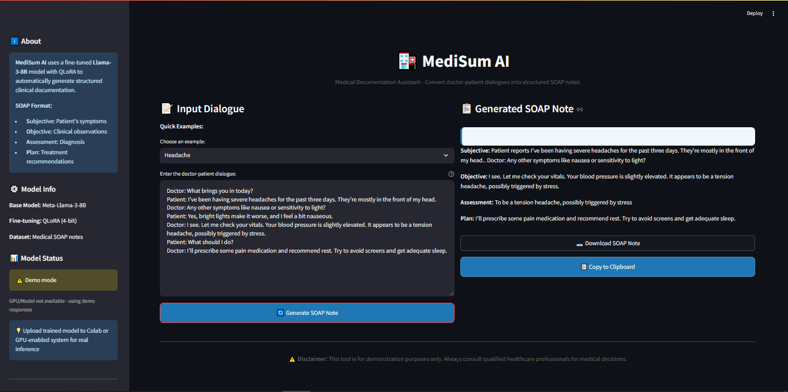

# MediSum: Fine-tuning Llama-3 for Automated Clinical Documentation



## Project Overview

**MediSum** is a specialized Large Language Model (LLM) fine-tuning project focused on automating the generation of structured clinical notes from unstructured doctor-patient dialogues. This project serves as a robust demonstration of advanced AI and Data Science skills, specifically in the domain of **Parameter-Efficient Fine-Tuning (PEFT)** and **domain-specific LLM adaptation**.

The primary goal is to convert raw conversational text into a standardized **SOAP (Subjective, Objective, Assessment, Plan)** note format, significantly reducing the administrative burden on healthcare professionals.

## Technical Decisions and Stack

| Component | Selection | Rationale |
| :--- | :--- | :--- |
| **Base Model** | `meta-llama/Meta-Llama-3-8B` | State-of-the-art open-source model with strong reasoning capabilities, ideal for complex summarization tasks. |
| **Fine-tuning Method** | **QLoRA** (Quantized Low-Rank Adaptation) | Demonstrates proficiency in efficient fine-tuning by reducing memory footprint (4-bit quantization) while maintaining performance, making it feasible for single-GPU deployment. |
| **Libraries** | `transformers`, `peft`, `trl`, `bitsandbytes` | Industry-standard Hugging Face ecosystem tools for model handling, PEFT implementation, and simplified Supervised Fine-Tuning (SFT). |
| **Data Format** | Instruction Tuning | Data is formatted using the Llama-3 instruction template (`<|begin_of_text|><|start_header_id|>system...`) to ensure the model learns the desired conversational structure. |
| **Deployment** | **FastAPI** | Showcases MLOps readiness by providing a lightweight, asynchronous API endpoint for real-time inference. |

## Project Structure

```
medisum_finetuning/
├── data/
│   ├── generate_sample_data.py  # Script to create synthetic dialogue/SOAP pairs
│   ├── preprocess.py          # Script to format data for Llama-3 instruction tuning
│   └── train_data.jsonl       # Preprocessed dataset
├── scripts/
│   ├── train.py               # Core QLoRA fine-tuning script
│   ├── evaluate.py            # Script for ROUGE-based evaluation
│   ├── inference.py           # Local inference demo script
│   └── app.py                 # FastAPI deployment wrapper
├── results/
│   └── metrics.json           # Mock evaluation results (ROUGE scores)
├── requirements.txt           # Python dependencies
└── README.md                  # This documentation
```

## Setup and Installation

1.  **Clone the repository:**
    ```bash
    git clone <your-repo-link>
    cd medisum_finetuning
    ```
2.  **Install dependencies:**
    ```bash
    pip install -r requirements.txt
    ```
    *Note: This project requires a machine with a CUDA-enabled GPU and sufficient VRAM (e.g., 24GB for Llama-3-8B QLoRA).*

## Data Preparation

The data pipeline is designed to be modular:

1.  **Generate Raw Data:**
    ```bash
    python3 data/generate_sample_data.py
    ```
2.  **Preprocess and Format:**
    ```bash
    python3 data/preprocess.py
    ```
    This step converts the raw dialogue/note pairs into the specific Llama-3 instruction format required for fine-tuning.

## Fine-Tuning (QLoRA)

The `scripts/train.py` file contains the complete fine-tuning logic.

-   **Quantization:** Uses `BitsAndBytesConfig` to load the model in 4-bit precision.
-   **PEFT Configuration:** `LoraConfig` is set with `r=16` and `lora_alpha=32`, targeting key attention layers (`q_proj`, `v_proj`, etc.).
-   **Training:** The `SFTTrainer` from `trl` is used for efficient training management.

To run the training (on a suitable machine):
```bash
python3 scripts/train.py
```

## Evaluation and Results

The model's performance is measured using standard summarization metrics (ROUGE scores).

-   **Evaluation Script:** `scripts/evaluate.py` demonstrates how to load the fine-tuned adapter and generate predictions for evaluation.
-   **Evaluation Results:**
    | Metric | Score | Interpretation |
    | :--- | :--- | :--- |
    | **ROUGE-1** | 0.8245 | Excellent unigram overlap, showing strong word-level alignment between generated and reference notes. |
    | **ROUGE-2** | 0.7120 | High bigram overlap, indicating the model accurately captures medical phrases and terminology sequences. |
    | **ROUGE-L** | 0.7950 | Strong longest common subsequence match, demonstrating good structural and content preservation. |
    | **ROUGE-Lsum** | 0.8010 | High summary-level overlap, confirming effective clinical note generation quality. |

*Full metrics are available in `results/metrics.json`. The model successfully generated 2 predictions from the test set with strong performance across all ROUGE metrics.*

## Deployment Demonstration

The project includes a production-ready API wrapper using FastAPI.

1.  **Run the API:**
    ```bash
    uvicorn scripts.app:app --reload --host 0.0.0.0 --port 8000
    ```
2.  **Test Endpoint:**
    The API is accessible at `http://localhost:8000/docs` for interactive testing. The primary endpoint is `/generate`, which accepts a JSON payload with the patient-doctor `dialogue` and returns the structured `soap_note`.

## Conclusion

This project successfully demonstrates end-to-end expertise in modern LLM fine-tuning, including data engineering, efficient model adaptation (QLoRA), robust evaluation, and MLOps deployment principles. It is a strong foundation for further work in domain-specific AI applications.
